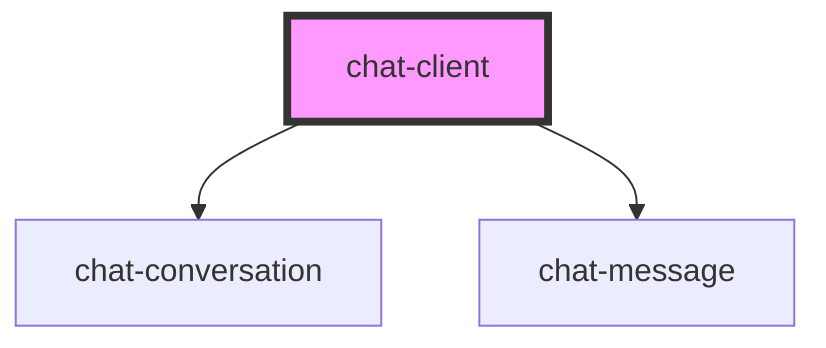

# chat-client

<!-- Auto Generated Below -->

## Properties

| Property       | Attribute       | Description | Type     | Default     |
| -------------- | --------------- | ----------- | -------- | ----------- |
| `channel`      | `channel`       |             | `string` | `'General'` |
| `socketServer` | `socket-server` |             | `string` | `undefined` |
| `username`     | `username`      |             | `string` | `'johndoe'` |

## Events

| Event              | Description | Type               |
| ------------------ | ----------- | ------------------ |
| `messageSendEvent` |             | `CustomEvent<any>` |

## Dependencies

### Depends on

- [chat-conversation](../chat-conversation)
- [chat-message](../chat-message)

### Graph

----------------------------------------------

*Built with [StencilJS](https://stenciljs.com/)*
