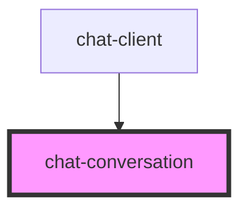

# chat-conversation

<!-- Auto Generated Below -->

## Properties

| Property       | Attribute | Description | Type        | Default     |
| -------------- | --------- | ----------- | ----------- | ----------- |
| `chatmessages` | --        |             | `Message[]` | `undefined` |

## Dependencies

### Used by

 - [chat-client](../chat-client)

### Graph

----------------------------------------------

*Built with [StencilJS](https://stenciljs.com/)*
