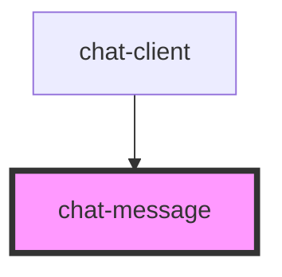

# chat-message

<!-- Auto Generated Below -->

## Events

| Event              | Description | Type               |
| ------------------ | ----------- | ------------------ |
| `messageSendEvent` |             | `CustomEvent<any>` |

## Dependencies

### Used by

 - [chat-client](../chat-client)

### Graph

----------------------------------------------

*Built with [StencilJS](https://stenciljs.com/)*
